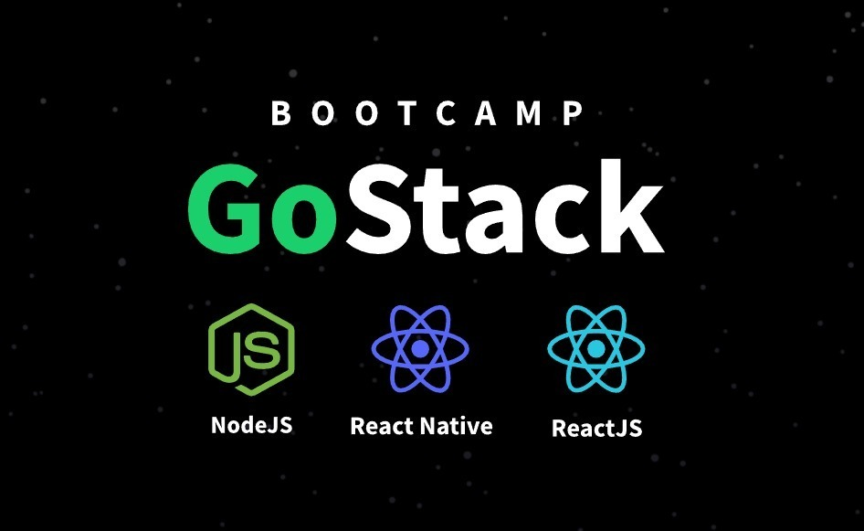

# Bootcamp GoStack 11

  <a href="https://www.linkedin.com/in/rafael-monteiro-68005b165/">
   
  <a/>
   
  

  
   
    
   
  

  
  
  
  

This repository aims to serve as an index and history of projects developed during Bootcamp, but it should also be used to annotate important or useful tools and libraries for the development in the Stack addressed.

## About GoStack Bootcamp

As defined by RocketSeat, GoStack is an intensive, online training focused on practice and productivity. GoStack covers in depth the Node.js, React and React Native technologies as well as the necessary tools so that it can be done from development to deploy. Including testing, continuous integration, publishing in stores and the most used libraries and frameworks to be able to face real challenges.

# NodeSs
## Libraries
* Express - Server creation
* Nodemon - Restart the server every time a file is changed - must be installed with the '-D' flag indicating that it is for development only

# Typescript

# ReactJs

# React Native

## Settings
* Nodemon:
  
     * Add "scripts" like the "dev" command to execute the index file

# Exercises

## Nivel 
:computer: **Nivel 1**  
 Conceitos Nodejs, ReactJs, React Native

## Challenges
 :mortar_board: **Nivel 1**  
* [Conceitos NodeJs](https://github.com/RafaelMScience/conceitos_nodejs)
* [Conceitos ReactJs](https://github.com/RafaelMScience/conceitos_reactjs)
* [Conceitos React-Native](https://github.com/RafaelMScience/conceitos_reactnative)
* [Conceitos Typescript](https://github.com/RafaelMScience/conceitos_typescript)

# GoBarber
